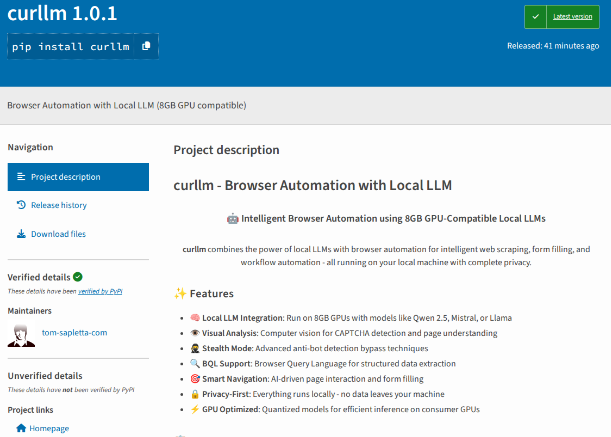

<p align="center">
  
</p>

<h1 align="center">curllm = curl + LLM</h1>

<p align="center">
  <strong>Intelligent Browser Automation with Local LLMs</strong>
</p>

<p align="center">
  <a href="https://pypi.org/project/curllm/"></a>
  <a href="https://pypi.org/project/curllm/"></a>
  <a href="https://github.com/wronai/curllm/blob/main/LICENSE"></a>
  <a href="https://github.com/wronai/curllm/stargazers"></a>
  <a href="https://github.com/wronai/curllm/issues"></a>
</p>

<p align="center">
  <a href="#-quick-start">Quick Start</a> •
  <a href="#-features">Features</a> •
  <a href="#-examples">Examples</a> •
  <a href="docs/INDEX.md">Documentation</a> •
  <a href="docs/API.md">API</a>
</p>

---

## 🎯 What is curllm?

**curllm** is a powerful CLI tool that combines browser automation with local LLMs (like Ollama's Qwen, Llama, Mistral) to intelligently extract data, fill forms, and automate web workflows - all running **locally** on your machine with **complete privacy**.

> 🆕 **v2 LLM-DSL Architecture!** Dynamic element detection, semantic goal understanding, no hardcoded selectors. 388 tests passing.

```bash
# Extract products with prices from any e-commerce site
curllm "https://shop.example.com" -d "Find all products under $100"

# Fill contact forms automatically
curllm --stealth "https://example.com/contact" -d "Fill form: name=John, email=john@example.com"

# Extract all emails from a page
curllm "https://example.com" -d "extract all email addresses"
```

## ✨ Features

| Feature | Description |
|---------|-------------|
| 🧠 **Local LLM** | Works with 8GB GPUs (Qwen 2.5, Llama 3, Mistral) |
| 🎯 **Smart Extraction** | LLM-guided DOM analysis - no hardcoded selectors |
| 📝 **Form Automation** | Auto-fill forms with intelligent field mapping |
| 🥷 **Stealth Mode** | Bypass anti-bot detection |
| 👁️ **Visual Mode** | See browser actions in real-time |
| 🔍 **BQL Support** | Browser Query Language for structured queries |
| 📊 **Export Formats** | JSON, CSV, HTML, XLS output |
| 🔒 **Privacy-First** | Everything runs locally - no cloud APIs needed |

## 🧠 LLM-DSL Architecture

curllm v2 uses **LLM-DSL** (LLM Domain Specific Language) - a dynamic approach that eliminates hardcoded selectors:

```
┌─────────────────────────────────────────────────────────────┐
│                     LLM-DSL Flow                            │
├─────────────────────────────────────────────────────────────┤
│  1. Goal Detection (semantic)                               │
│     "Find RAM DDR5" → FIND_PRODUCTS                         │
│                                                             │
│  2. Strategy Selection                                      │
│     FIND_PRODUCTS → use search flow                         │
│     FIND_CART → find link by semantic scoring               │
│                                                             │
│  3. Element Finding (LLM-first)                             │
│     LLM analysis → Statistical scoring → Fallback           │
│                                                             │
│  4. Dynamic Selector Generation                             │
│     Analyze DOM → Score elements → Generate selector        │
└─────────────────────────────────────────────────────────────┘
```

### Key Benefits

| Feature | Traditional | LLM-DSL |
|---------|-------------|---------|
| Selectors | Hardcoded CSS/XPath | Dynamic generation |
| Keywords | Static lists | Semantic analysis |
| Language | English only | Multi-language (PL, EN) |
| Maintenance | Manual updates | Self-adapting |

## 🚀 Quick Start

### Installation

```bash
pip install -U curllm
curllm-setup      # One-time setup (installs Playwright browsers)
curllm-doctor     # Verify installation
```

### Requirements

- **Python** 3.10+
- **GPU**: NVIDIA with 6-8GB VRAM (RTX 3060/4060) or CPU mode
- **Ollama**: For local LLM inference

```bash
# Install Ollama (if not installed)
curl -fsSL https://ollama.ai/install.sh | sh
ollama pull qwen2.5:7b
```

## 📖 Examples

### Extract Data

```bash
# Extract all links
curllm "https://example.com" -d "extract all links"

# Extract emails
curllm "https://example.com/contact" -d "extract all email addresses"
# Output: {"emails": ["info@example.com", "sales@example.com"]}

# Extract products with price filter
curllm --stealth "https://shop.example.com" -d "Find all products under 500zł"
```

### Form Automation

```bash
# Fill contact form
curllm --visual --stealth "https://example.com/contact" \
  -d "Fill form: name=John Doe, email=john@example.com, message=Hello"

# Login automation
curllm --visual "https://app.example.com/login" \
  -d '{"instruction":"Login", "credentials":{"user":"admin", "pass":"secret"}}'
```

### Export Results

```bash
# Export to CSV
curllm "https://example.com" -d "extract all products" --csv -o products.csv

# Export to HTML
curllm "https://example.com" -d "extract all links" --html -o links.html

# Export to Excel
curllm "https://example.com" -d "extract all data" --xls -o data.xlsx
```

### Screenshots

```bash
# Take screenshot
curllm "https://example.com" -d "screenshot"

# Visual mode (watch browser)
curllm --visual "https://example.com" -d "extract all links"
```

### BQL Queries

```bash
curllm --bql -d 'query {
  page(url: "https://news.ycombinator.com") {
    title
    links: select(css: "a.titlelink") { text url: attr(name: "href") }
  }
}'
```

## 🌐 Web Interface

```bash
curllm-web start   # Start web UI at http://localhost:5000
curllm-web status  # Check status
curllm-web stop    # Stop server
```

Features:
- 🎨 Modern responsive UI
- 📝 19 pre-configured prompts
- 📊 Real-time log viewer
- 📤 File upload support

## 🔧 Configuration

Environment variables (`.env`):

```bash
CURLLM_MODEL=qwen2.5:7b          # LLM model
CURLLM_OLLAMA_HOST=http://localhost:11434
CURLLM_HEADLESS=true             # Run browser headlessly
CURLLM_STEALTH_MODE=false        # Anti-detection
CURLLM_LOCALE=en-US              # Browser locale
```

## 🏗️ Architecture

```
┌─────────────────────────────────────────────────────────────────┐
│                         curllm CLI                              │
├─────────────────────────────────────────────────────────────────┤
│                                                                 │
│  ┌────────────────┐    ┌────────────────┐    ┌───────────────┐  │
│  │  DSL Executor  │───▶│ Knowledge Base │───▶│ Strategy YAML │  │
│  │  (Orchestrator)│    │   (SQLite)     │    │    Files      │  │
│  └────────────────┘    └────────────────┘    └───────────────┘  │
│          │                                                      │
│          ▼                                                      │
│  ┌────────────────────────────────────────────────────────────┐ │
│  │                    DOM Toolkit (Pure JS)                   │ │
│  │  ┌──────────┐  ┌──────────┐  ┌──────────┐  ┌────────────┐  │ │
│  │  │Structure │  │ Patterns │  │Selectors │  │   Prices   │  │ │
│  │  │ Analyzer │  │ Detector │  │Generator │  │  Detector  │  │ │
│  │  └──────────┘  └──────────┘  └──────────┘  └────────────┘  │ │
│  └────────────────────────────────────────────────────────────┘ │
│          │                                                      │
│          ▼                                                      │
│  ┌────────────────────────────────────────────────────────────┐ │
│  │              Playwright Browser Engine                     │ │
│  │         (Chromium with Stealth & Anti-Detection)           │ │
│  └────────────────────────────────────────────────────────────┘ │
│          │                                                      │
│          ▼                                                      │
│  ┌────────────────────────────────────────────────────────────┐ │
│  │                 Ollama / LiteLLM                           │ │
│  │      (Local LLM: Qwen 2.5, Llama 3, Mistral, GPT, etc)     │ │
│  └────────────────────────────────────────────────────────────┘ │
└─────────────────────────────────────────────────────────────────┘
```

### Key Components

| Component | Description | LLM Calls |
|-----------|-------------|-----------|
| **URL Resolver** | Smart navigation with goal detection | 0-1 |
| **Goal Detector** | Semantic intent understanding | 0-1 |
| **Element Finder** | Dynamic selector generation | 0-1 |
| **DOM Toolkit** | Pure JavaScript atomic queries | 0 |
| **SPA Hydration** | Wait for CSR/SPA content | 0 |

📖 **[Full Architecture Documentation →](docs/v2/architecture/ARCHITECTURE.md)**

## 🧬 DSL System (Strategy-Based Extraction)

> **Note:** The YAML DSL system works alongside the newer LLM-DSL. YAML strategies are used for **known sites** with proven extraction patterns, while LLM-DSL handles **unknown sites** dynamically.

curllm automatically **learns** and **saves** successful extraction strategies as YAML files:

```yaml
# dsl/ceneo_products.yaml - Auto-generated from successful extraction
url_pattern: "*.ceneo.pl/*"
task: extract_products
algorithm: statistical_containers

selector: div.product-card
fields:
  name: h3.title
  price: span.price
  url: a[href]

metadata:
  success_rate: 0.95
  use_count: 42
```

### How It Works

1. **First visit** - LLM-DSL dynamically analyzes page, extracts data
2. **Successful** - Strategy saved to `dsl/*.yaml`, recorded in Knowledge Base
3. **Next visit** - Knowledge Base loads saved strategy (fast path)
4. **Unknown site** - Falls back to LLM-DSL dynamic discovery

```
┌─────────────────────────────────────────────────────────┐
│                   Request Flow                          │
├─────────────────────────────────────────────────────────┤
│  URL → Knowledge Base lookup                            │
│        │                                                │
│        ├─ Found? → Load YAML strategy (fast)            │
│        │                                                │
│        └─ Not found? → LLM-DSL dynamic (flexible)       │
│                        │                                │
│                        └─ Success? → Save to YAML       │
└─────────────────────────────────────────────────────────┘
```

### Algorithms

| Algorithm | Best For | Speed |
|-----------|----------|-------|
| `statistical_containers` | Product grids | ⚡ Fast |
| `pattern_detection` | Lists, tables | ⚡ Fast |
| `llm_guided` | Complex layouts | 🐢 Slower |
| `form_fill` | Contact forms | ⚡ Fast |

📖 **[DSL System Documentation →](docs/v2/architecture/DSL_SYSTEM.md)**

## 🤝 Multi-Provider LLM Support

curllm supports multiple LLM providers via LiteLLM:

```python
from curllm_core import LLMConfig

# OpenAI
config = LLMConfig(provider="openai/gpt-4o-mini")

# Anthropic
config = LLMConfig(provider="anthropic/claude-3-haiku-20240307")

# Google Gemini
config = LLMConfig(provider="gemini/gemini-2.0-flash")

# Local Ollama (default)
config = LLMConfig(provider="ollama/qwen2.5:7b")
```

## 📚 Documentation

### Getting Started
- **[📖 Full Documentation](docs/v2/README.md)**
- **[⚙️ Installation Guide](docs/v2/guides/INSTALLATION.md)**
- **[📝 Examples & Tutorials](docs/v2/guides/EXAMPLES.md)**

### Architecture
- **[🏗️ System Architecture](docs/v2/architecture/ARCHITECTURE.md)**
- **[🧬 DSL System](docs/v2/architecture/DSL_SYSTEM.md)** - Strategy-based extraction
- **[⚛️ DOM Toolkit](docs/v2/architecture/ATOMIC_QUERY_SYSTEM.md)** - Pure JS queries
- **[🧩 Components](docs/v2/architecture/COMPONENTS.md)** - Module overview
- **[🔗 LLM-DSL URL Resolution](docs/LLM_DSL_URL_RESOLUTION.md)** - Smart URL navigation

### Reference
- **[🔌 API Reference](docs/v2/api/README.md)**
- **[🛠️ Configuration](docs/v2/guides/CONFIGURATION.md)**
- **[❓ Troubleshooting](docs/v2/guides/TROUBLESHOOTING.md)**

## 🧪 Development

```bash
# Clone and install
git clone https://github.com/wronai/curllm.git
cd curllm
make install

# Run tests (388 tests passing)
make test

# Run URL resolver examples
cd examples/url_resolver && python run_all.py

# Run with Docker
docker compose up -d
```

## 📄 License

Apache License 2.0 - see [LICENSE](LICENSE)

## 🙏 Acknowledgments

Built with:
- [Playwright](https://playwright.dev/) - Browser automation
- [Ollama](https://ollama.ai/) - Local LLM inference
- [LiteLLM](https://github.com/BerriAI/litellm) - Multi-provider LLM support
- [Flask](https://flask.palletsprojects.com/) - Web framework

---

<p align="center">
  <strong>⭐ Star this repo if you find it useful!</strong>
</p>

<p align="center">
  Made with ❤️ by <a href="https://github.com/wronai">wronai</a>
</p>
